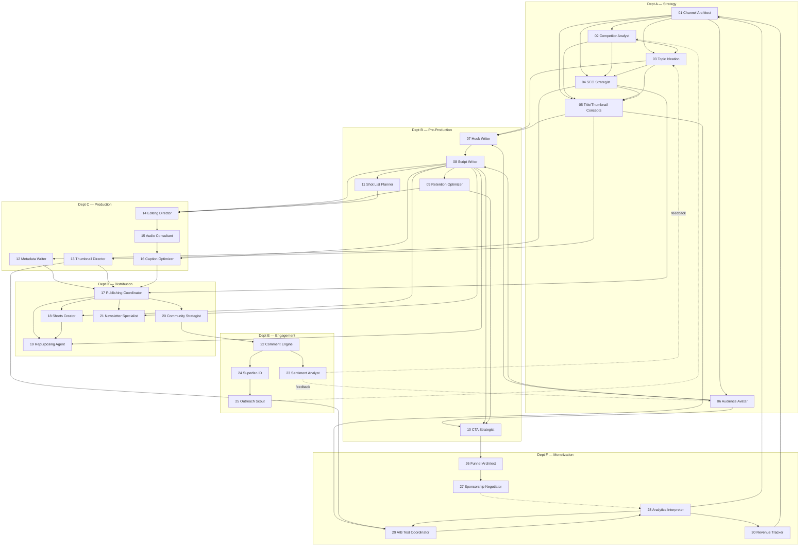

# WORKFLOW.md

The actual dependency graph between agents, extracted from each SOP's "Receives Input From" / "Sends Output To" fields — this is the real pipeline, not just the department grouping in the roster.

## Full Dependency Graph

**Solid arrows** = required input. **Dotted arrows** = feedback/loop-back (informs future cycles, doesn't block the current one).

## Named Pipelines

### 1. Standard Video Pipeline (idea → published)
`01 → 03 → 04 → 05 → 07 → 08 → [09, 10, 11] → [12, 13, 14, 16] → 15 → 17`

Run this per video. Agents 09–16 can run in parallel once 08 (script) is done — they don't depend on each other, only on the script.

### 2. Post-Publish Distribution Pipeline
`17 → [18, 19, 20, 21]` (parallel — all four only need the published video + metadata from 17)

### 3. Engagement Loop (continuous, not per-video)
`20 → 22 → [23, 24] → 25` and `23 → back to 03, 06` (sentiment feeds future ideation and the audience avatar — this is how the system learns from its audience instead of guessing).

### 4. Monetization Loop (monthly/quarterly cadence, not per-video)
`10 → 26 → 27 → 28 → [29, 30] → back to 01` (revenue and analytics data feed back into channel strategy — this is the system's only path from "content" to "business decisions").

### 5. Optimization Loop (per-video, after publish)
`28 → 29 → 28` (A/B test results refine future analytics baselines) — this is the only genuine two-way loop; everything else is one-directional or feeds forward into the strategy loop.

### 6. Learning Loop (ties `STATE.md` and `MEMORY.md` into the pipeline)
`Published videos → STATE.md §2 (metrics logged) → 28 (pattern extraction) → MEMORY.md (insights written) → back into 01, 03, 05, 06, 07, 10, 17 (applied on future runs)`

This is what makes the system's output quality change over time instead of staying flat from video 1 to video 100. The graph edge is documented here; the actual extraction algorithm, evidence-strength rules, and failure modes are documented once, in `LOOP.md` — see that file, not this one, for how Agent 28 actually does the extraction.

## Suggested Operating Cadence

This isn't specified in the original SOPs — it's a recommended default; adjust to your actual publish frequency.

| Cadence | Run |
|---|---|
| Per video | Pipeline 1 → 2 |
| Daily/every 2-3 days | Pipeline 3 (comment engagement) |
| Weekly | 28 (analytics review) |
| Every 5 published videos | 28 runs `MEMORY.md` pattern extraction (Pipeline 6) — matches the `emerging` confidence threshold in `MEMORY.md`; running it more often than this just churns `provisional` entries with nothing new to say |
| Monthly | Pipeline 4 (monetization loop), 29 result review |
| Quarterly | 01 + 02 full strategy re-audit |

## Critical Path vs. Optional Branches

**Critical path** (a video cannot ship without these): 01 → 03 → 08 → 17. Everything else enriches or distributes that core, but 17 (publish) only hard-depends on 12, 13, 16 being done — 14/15 (edit/audio) happen outside this system entirely (they're briefs *for* a human editor, not automatable outputs).

**Optional branches:** 18–21 (repurposing), 20–25 (community/superfans), and all of Dept F are growth multipliers, not blockers — a channel can run Pipeline 1+2 alone and still publish.
